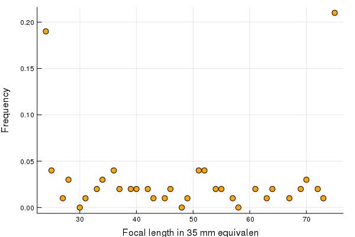
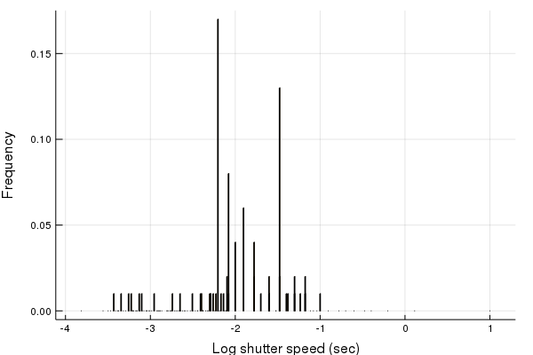
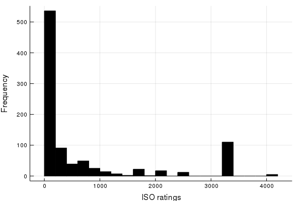
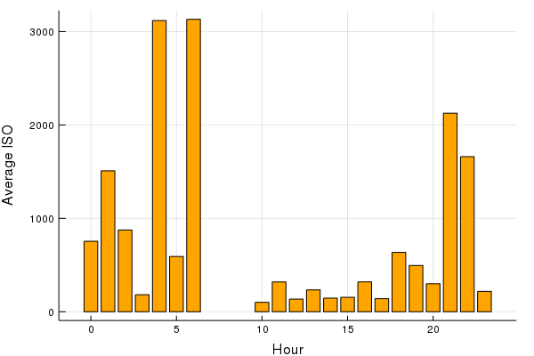
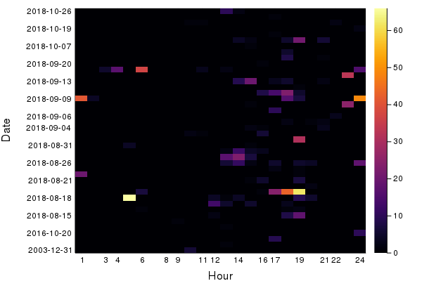
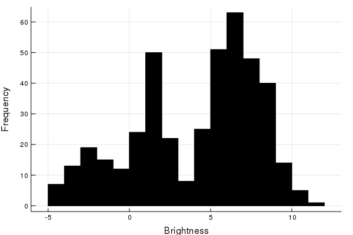
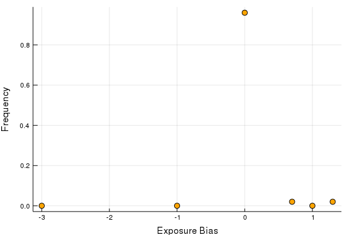

# Motivation

Using this package, you can get statistics and figures about your photography habits: what are your mostly used camera settings? How often and at which times do you shoot? How do you often shoot in different lighting situations? Knowing photography habits can help in deciding which lens and camera to buy.

# Features:

The package recursively reads exif data from images in a directory and reports the following plots:

### Focal length expressed in “35mm equivalent”



### Shutter speed on logarithmic scale



### Aperture


### ISO values



### ISO values as a function of day time



### A heatmap of date and time of shooting photos



### Brightness



### Exposure bias




# Installation

This package works with Julia 1.0. Clone it as follows:

```
git clone https://github.com/kavir1698/AnalyzeImageMetadata.jl.git
```

It requires these Julia packages: `ImageMagick`, `Plots`, `GR`, `CSV`, `DataFrames`, `ProgressMeter`.

# Usage


Analyze images in any directory by calling the module the command line as following:

```
$ julia AnalyzeImageMetadata.jl photos-dir jpg
```

where `photos dir` is the path to a directory that contains your photos, and `jpg` is the format of the images you want to analyze (currently only tested with jpg files). 

Plots will be saved in `photos dir` in a subdirectory called `AnalyzeImageMetadata`.

I currently use `ImageMagick.jl` for extracting EXIF data, which is slow in reading EXIF data. Please be patient when analyzing a directory for the first time.